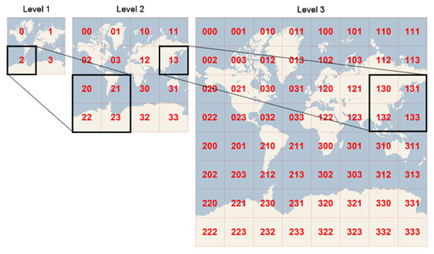
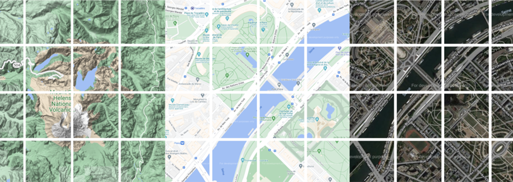

# OPEN LAYERS 10 Eğitimi

## 1-Temel Kavramlar

### 1.1-OpenLayers nedir? Ne işe yarar?
OpenLayers, açık kaynaklı bir JavaScript kütüphanesidir. 
Web tabanlı interaktif haritalar oluşturmak için kullanılır.
Çeşitli harita veri kaynaklarını (WMS, WMTS, GeoJSON, KML vb.) destekler.
OpenStreetMap, Bing Maps, Google Maps gibi harita servisleriyle entegre çalışabilir.

### 1.2-Alternatif harita uygulamaları
Leaflet.js, 
Mapbox GL JS, 
Google Maps JavaScript API, 
CesiumJS, 
MapLibre GL JS

### 1.3-Temel Harita Bileşenleri
#### 1.3.1-Map (Harita Nesnesi)
Haritanın temel taşıdır. Tüm bileşenler bu nesneye bağlanarak harita üzerine eklenir.

İçerisinde hangi bileşenleri içerir?
`View:` Haritanın merkezini, zoom seviyesini ve projeksiyonunu tanımlar.
`Layers:` Harita üzerine eklenen görsel veya vektör katmanları içerir.
`Controls:` Kullanıcı etkileşimlerini kolaylaştıran butonlar ve kontrollerdir.
`Interactions:` Kullanıcının harita üzerinde sürükleme, yakınlaştırma gibi işlemleri yapmasını sağlar.

#### 1.3.2-View (Görünüm)

Haritanın nasıl görüntüleneceğini belirler.
`center:` Haritanın başlangıçta merkezleneceği koordinatları belirler.
`zoom:` Başlangıçtaki yakınlaştırma seviyesini tanımlar.
`projection:` Koordinat sistemini belirler (örneğin EPSG:3857 veya EPSG:4326).
`extent:` Harita görünümünün kapsayacağı maksimum alanı belirler.

#### 1.3.3-Layer (Katmanlar)
Haritada görüntülenen farklı veri katmanlarını ifade eder. Birden fazla katman üst üste eklenerek farklı veri görselleştirmeleri yapılabilir.
İki temel türü vardır:
`Raster Katmanları:` Harita görselleri içerir (örneğin OSM, Bing Maps, Google Maps).
`Vektör Katmanları:` Nokta, çizgi ve çokgen verilerini içerir (örneğin GeoJSON, KML).

#### 1.3.4-Tile (Döşeme Katmanı)

Harita görüntülerini döşeme (tile) şeklinde yükleyerek performansı artırır. 
Genellikle harita sağlayıcılarından (OpenStreetMap, Google Maps, Bing Maps vb.) alınan raster görüntülerle çalışır.

#### 1.3.5-Source (Veri Kaynağı)

Harita katmanlarına (Layer) veri sağlayan bileşendir. Haritanın görsel içeriği katmanlardan (Layer) oluşurken, bu katmanların hangi veriyi göstereceğini source (kaynak) belirler.

`Layer (Katman)` bir veri gösterim yöntemidir (örneğin Tile Layer, Vector Layer).
`Source (Kaynak)`, katmanın verisini aldığı yerdir (örneğin OpenStreetMap, WMS, GeoJSON).

Raster Veri Kaynakları (Görüntü Tabanlı Kaynaklar)

ol.source.OSM → OpenStreetMap döşemeleri
ol.source.XYZ → Google Maps gibi harita servislerinden döşeme yükler
ol.source.BingMaps → Bing Maps uydu haritaları
ol.source.TileWMS → WMS (Web Map Service) sunucusundan harita döşemeleri
ol.source.WMTS → WMTS (Web Map Tile Service) sunucusundan harita döşemeleri

Vektör Veri Kaynakları (Coğrafi Veri Tabanlı)

ol.source.Vector → GeoJSON, KML, GPX gibi dosyalarla çalışır.
ol.source.VectorTile → Vektör döşemeleriyle çalışır (Örn: Mapbox Vector Tiles - MVT).

#### 1.3.6-Control (Kontroller)

Haritada kullanıcı etkileşimini artıran araçları ifade eder. 

OpenLayers tarafından sağlanan bazı hazır kontroller şunlardır:

ol.control.Zoom: Zoom in/out butonları
ol.control.FullScreen: Haritayı tam ekran yapma
ol.control.ScaleLine: Ölçek çizgisi ekleme
ol.control.OverviewMap: Küçük genel harita gösterme
ol.control.Attribution: Harita sağlayıcısı bilgilerini ekleme

## 2-İlk Haritanın Oluşturulması

* OpenLayers’ı CDN veya npm ile projeye ekleme
* Temel harita gösterimi
* Map ve View nesnelerinin yapılandırılması
* Varsayılan katmanlar (OSM)

## 3-Katmanlar (Layers)
* Tile Katmanları
* * TileLayer ve XYZ kaynakları ile harita sağlayıcılarını kullanma (Ör: OSM, Stamen, Google Maps).
* * -> https://tiles.stadiamaps.com/tiles/stamen_terrain/{z}/{x}/{y}.png
* * Katman değiştirme/yönetme
* Vektör Katmanları
* * VectorLayer ve VectorSource kavramları.
* * GeoJSON verilerini haritada gösterme.
* * -> https://geojson.io/#map=10.27/40.9444/29.2071

## 4-View (Görünüm)
* Merkez Koordinatı
* Zoom Seviyesi
* Döndürme
* Projeksiyon Sistemleri(EPSG:4326 vs EPSG:3857)